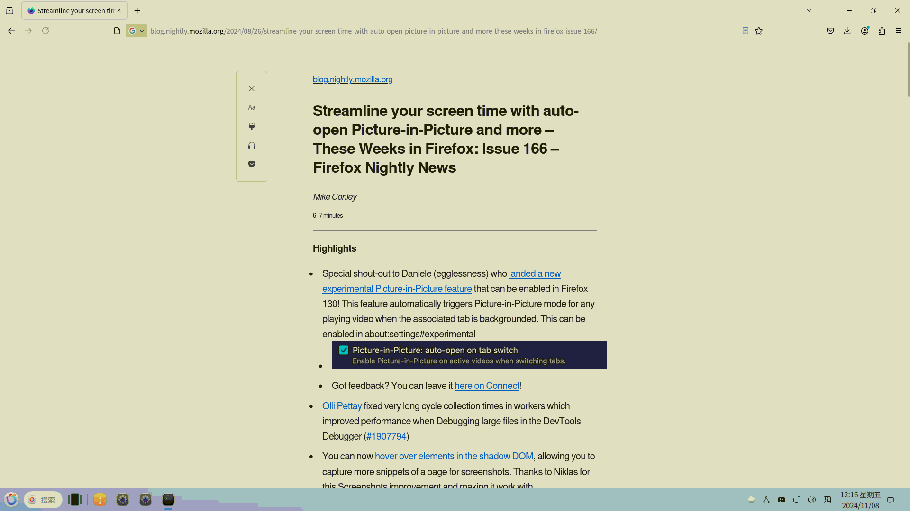
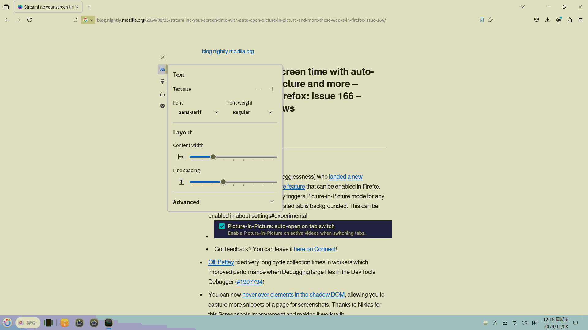
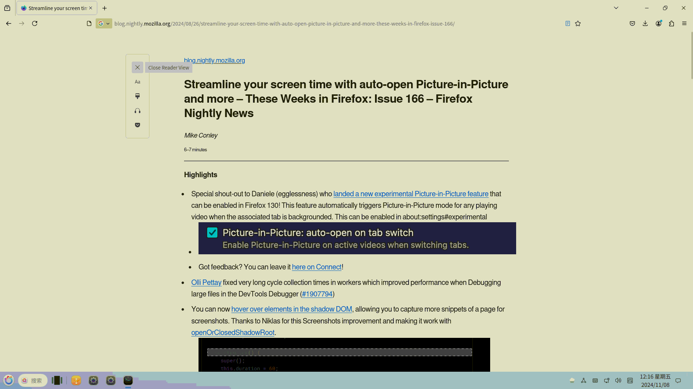
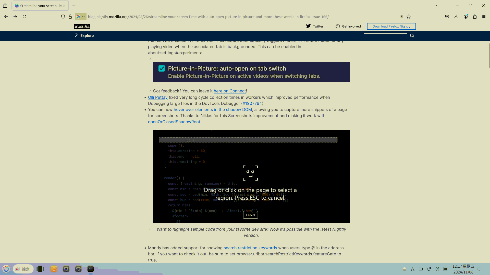

# 查看 - 设置阅读模式

## 摘要

设置阅读模式。

## 操作步骤

进入阅读模式时，屏幕左侧设置修改阅读模式设置，

调节阅读模式的布局（字体、字号、行宽、行距）和主题（明亮、深色、黑暗），退出，朗读。

## 预期结果

进入阅读模式成功，可以进行设置。

## 其他说明

无。

## 实际结果

点击进入阅读模式

成功进入

布局（字体、字号、行宽、行距）主题（明亮、深色、黑暗）可以成功调整

点击退出

退出成功

